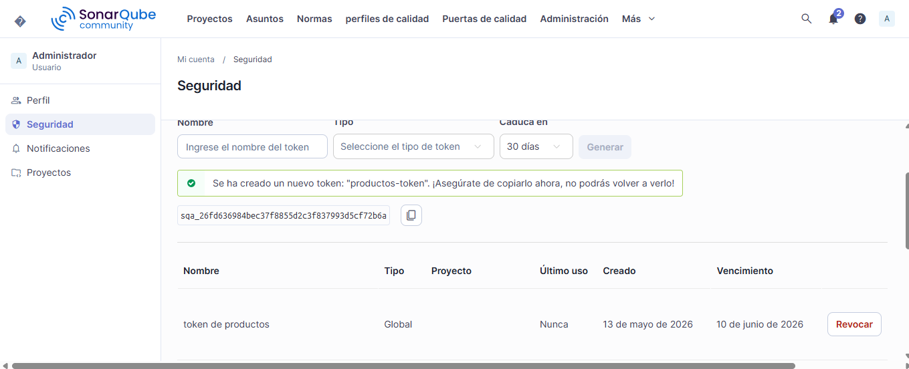
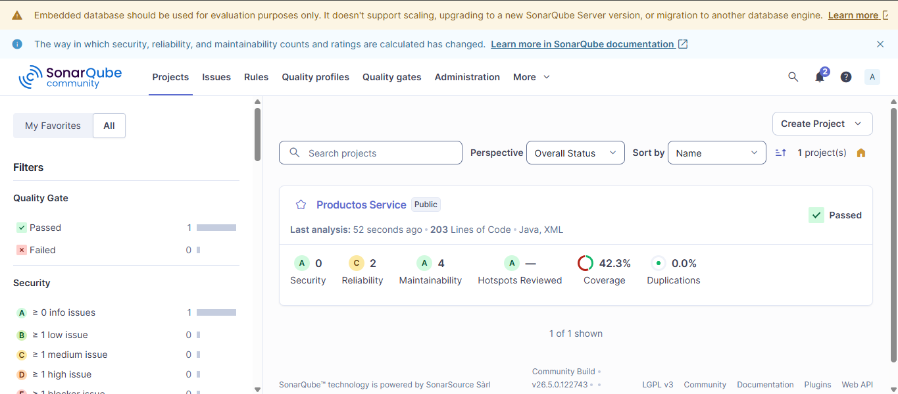
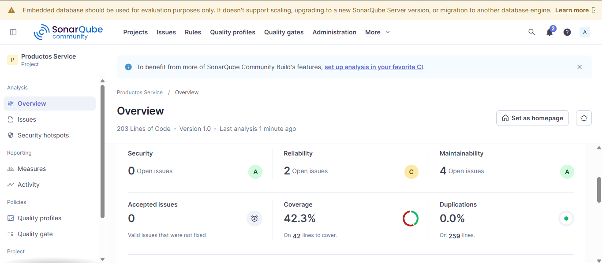

# Productos Service — Análisis SonarQube
## Post-Contenido 1 — Patrones de Diseño de Software

## Prerrequisitos
- JDK 21
- Maven 3.9+
- Docker Desktop

## Cómo ejecutar el análisis

```bash
# 1. Levantar SonarQube
docker run -d --name sonarqube -p 9000:9000 -e SONAR_ES_BOOTSTRAP_CHECKS_DISABLE=true sonarqube:community

# 2. Compilar y generar reporte JaCoCo
mvn clean verify

# 3. Enviar análisis a SonarQube
mvn sonar:sonar "-Dsonar.token=sqa_26fd636984bec37f8855d2c3f837993d5cf72b6a" "-Dsonar.host.url=http://127.0.0.1:9000"
```

## Estado inicial del análisis

| Categoría        | Cantidad | Rating |
|------------------|----------|--------|
| Bugs             | X        | X      |
| Vulnerabilidades | X        | X      |
| Code Smells      | X        | X      |
| Cobertura        | X%       | —      |

## Hallazgos principales identificados

### Bug 1: Retorno de null en búsqueda por ID
- **Archivo:** ProductoService.java, línea 44
- **Descripción:** El método `buscar()` retorna `null` cuando no encuentra el producto en lugar de lanzar una excepción, causando posibles NullPointerException.
- **Severidad:** Major

### Bug 2: Campo nombre sin restricción de nulidad
- **Archivo:** Producto.java, línea 8
- **Descripción:** El campo `nombre` no tiene `@Column(nullable=false)`, permitiendo guardar productos sin nombre.
- **Severidad:** Minor

### Code Smell 1: Inyección de dependencias por campo
- **Archivo:** ProductoService.java, línea 17
- **Descripción:** Se usa `@Autowired` en campo en lugar de inyección por constructor, dificultando las pruebas unitarias.

### Code Smell 2: Método con alta complejidad ciclomática
- **Archivo:** ProductoService.java, línea 21
- **Descripción:** `procesarProducto()` concentra múltiples validaciones en un solo método, aumentando su complejidad ciclomática.

### Code Smell 3: Rama inalcanzable en getEstado()
- **Archivo:** Producto.java, línea 29
- **Descripción:** El último `return "DESCONOCIDO"` nunca se ejecuta porque todos los casos posibles ya fueron cubiertos por las condiciones anteriores.

## Capturas del dashboard


