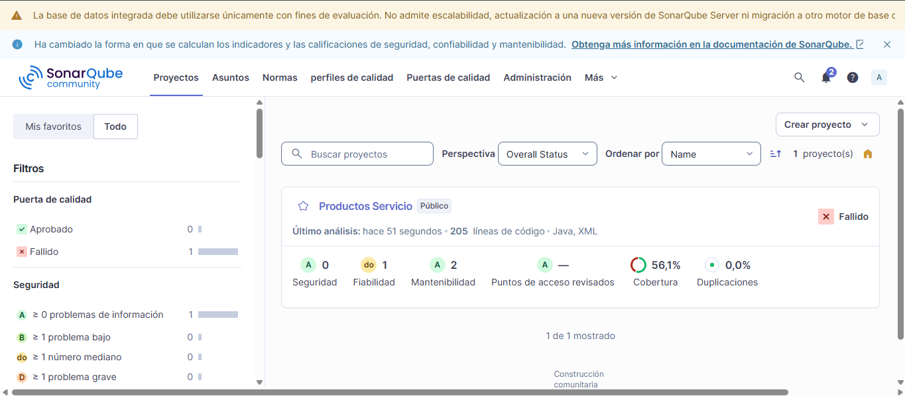
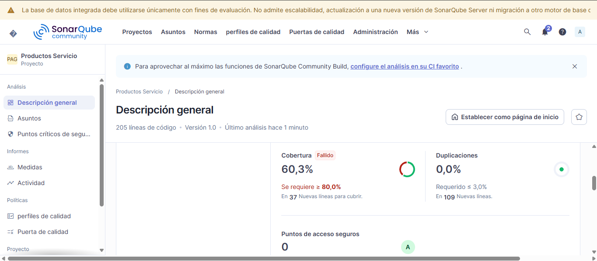

# Productos Service — Post-Contenido 2
## Métricas de Calidad y SonarQube — Patrones de Diseño de Software

## Prerrequisitos
- JDK 21
- Maven 3.9+
- Docker Desktop

## Cómo ejecutar el análisis

```bash
# 1. Levantar SonarQube
docker run -d --name sonarqube -p 9000:9000 -e SONAR_ES_BOOTSTRAP_CHECKS_DISABLE=true sonarqube:community

# 2. Compilar, probar y generar reporte JaCoCo
mvn clean verify

# 3. Enviar análisis a SonarQube
mvn sonar:sonar "-Dsonar.token=sqa_26fd636984bec37f8855d2c3f837993d5cf72b6a" "-Dsonar.host.url=http://127.0.0.1:9000"
```

## Quality Gate — Estándar Universidad
Configurado en SonarQube con las siguientes condiciones:
- Bugs es mayor que 0
- Coverage es menor que 60%
- Code Smells es mayor que 5
- Líneas duplicadas (%) es mayor que 5%

## Comparativa antes y después de las correcciones

| Categoría        | Antes (Post-1) | Después (Post-2) |
|------------------|----------------|------------------|
| Bugs             | 1              | 0                |
| Code Smells      | 3+             | 2                |
| Cobertura        | ~30%           | 60.3%            |
| Duplicaciones    | 0.0%           | 0.0%             |

## Correcciones aplicadas

### Bug corregido: orElse(null)
- **Archivo:** ProductoService.java
- **Antes:** `return repo.findById(id).orElse(null)`
- **Después:** lanza `NoSuchElementException` con mensaje descriptivo

### Code Smell 1: Inyección por constructor
- **Archivo:** ProductoService.java
- **Antes:** `@Autowired` en campo
- **Después:** inyección por constructor con campo `final`

### Code Smell 2: isBlank() en lugar de equals("")
- **Archivo:** ProductoService.java
- **Antes:** `nombre.equals("")`
- **Después:** `nombre.isBlank()`

### Code Smell 3: Extracción de método validarDatos()
- **Archivo:** ProductoService.java
- **Antes:** método `procesarProducto()` con alta complejidad ciclomática
- **Después:** validación extraída a método privado `validarDatos()`

## Capturas del dashboard

### Dashboard inicial (Post-Contenido 1)


### Dashboard después de correcciones (Post-Contenido 2)



## GitHub Actions
El workflow en `.github/workflows/ci.yml` ejecuta automáticamente
`mvn clean verify` en cada push a main.